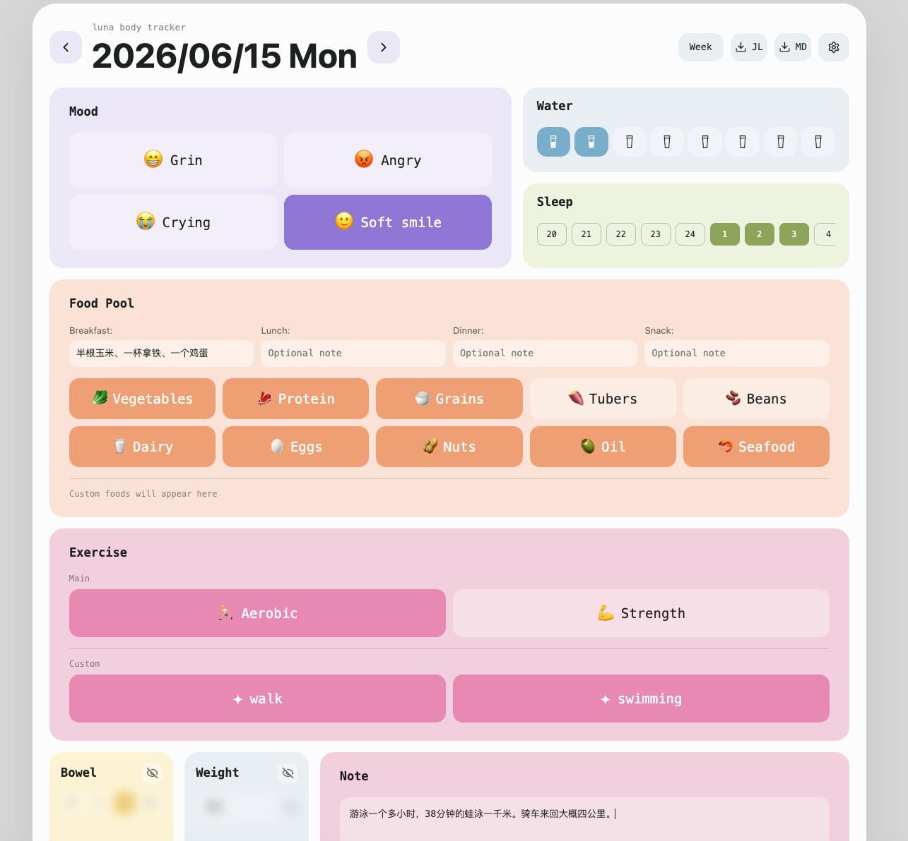
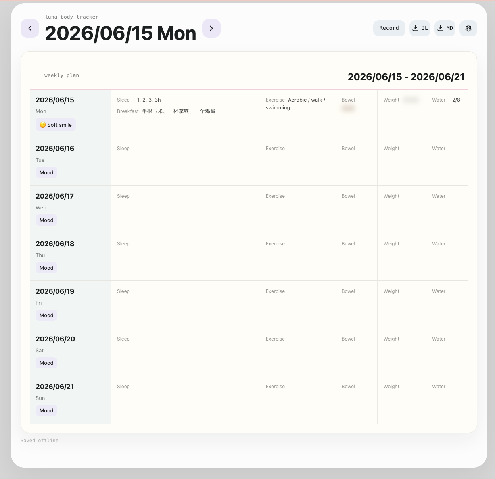

# Luna Body Tracker

Luna Body Tracker is a local-first, extensible body and mind tracking system for humans and AI agents.

It helps people record daily body signals, mood, food, sleep, menstrual cycle, bowel movements, notes, and custom personal modules. The project starts from a Chrome extension and grows into a shared open core for a PWA web app, AI skill, and future device integrations.

## Product Preview




## Current Apps

- `apps/extension`: Chrome extension for local daily tracking and export.
- `apps/web`: PWA web app that reuses the tracking UI for mobile and desktop.
- `apps/sync-server`: Optional self-hosted sync service for browser and PWA data.
- `apps/skill`: AI skill for low-token, safety-bounded record reading and summary.
- `apps/tracker-stickS3`: M5Stack StickS3 tree-avatar tracker prototype.
- `apps/yun-tracker-stickS3`: M5Stack StickS3 island-avatar tracker prototype inspired by a soft fantasy daily record loop.

## Device Preview

The StickS3 experiments explore a low-pressure, record-driven handheld companion. There is no failure state and no punishment loop: recording a real action becomes a small scene action in the device world.

### Yun Tracker StickS3

Lan is the user's small avatar in Andetai. Mood, stress, bowel movement, food, water, sleep, movement, and oracle actions map to small platform scenes.

Introduction:


Main secens:


:

Main flow: 

check pr: 


Current device features:

- Two-button StickS3 interaction using `BtnA` for confirm and `BtnB` for next.
- Eight entry actions: mood, stress, poop, food, water, sleep, sport, and oracle.
- Platform scene switching with transparent Lan frame animation.
- Local dirty-rectangle animation refresh for the character area.
- ASCII pixel text rendering for transparent text without firmware text backgrounds.
- Local JSON daily log storage on the device filesystem.

### Tree Tracker StickS3（Deprecated）

The first StickS3 prototype is a tree-avatar habit tracker with day/night scenes, food categories, water, mood, movement, and export-oriented record data.


## MVP Scope

- Chrome extension with bento-style daily tracking
- PWA web app for importing, viewing, and exploring records
- AI skill for agent-based reading, writing, validation, and summary
- Local-first storage
- JSONL and Markdown export
- Optional self-hosted sync for extension and PWA
- M5Stack StickS3 device prototypes for low-pressure daily recording
- Extensible module system
- System templates that can be hidden but not deleted
- User custom modules that can be created and soft deleted
- Basic harness for schema, import/export, UI, and AI tool validation

## Not In MVP

- Third-party cloud auto-sync
- Account system
- Payment
- Plugin marketplace
- Multi-user collaboration
- Complex encryption or permission management

## Project Structure

```text
luna-body-tracker/
  apps/
    extension/
    web/
    skill/
    sync-server/
    tracker-stickS3/
    yun-tracker-stickS3/

  packages/
    schema/
    storage/
    import-export/
    sync-protocol/
    plugin-api/
    ai-skill-sdk/
    ui/

  harness/
    fixtures/
    e2e/
    agent-runs/

  docs/
    architecture.md
    schema-v1.md
    mvp-roadmap.md
    open-core.md
```

## Technical Direction

- TypeScript monorepo
- pnpm workspace
- React for extension and PWA interfaces
- Zod for schema validation
- IndexedDB for browser local storage
- JSONL as the durable export format
- Markdown as the human-readable export format
- Versioned sync protocol for self-hosted extension/PWA sync
- Vitest for package tests
- Playwright for UI and workflow harness
- MCP / OpenAPI / JSON-RPC compatible AI skill adapters

## Design Principles

- User data belongs to the user.
- The default storage mode is local-first.
- Sync is explicit, local-first, and optional.
- Export formats should be open, readable, and stable.
- System modules are product protocol, not disposable user data.
- User custom modules are user-owned data and should never be hard deleted.
- AI agents interact with data through controlled APIs, not direct storage access.
