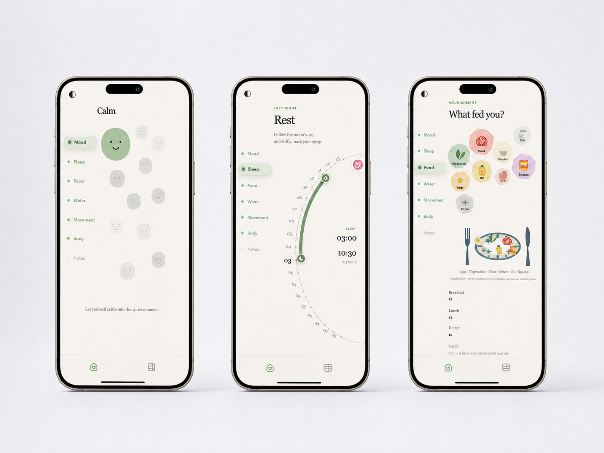
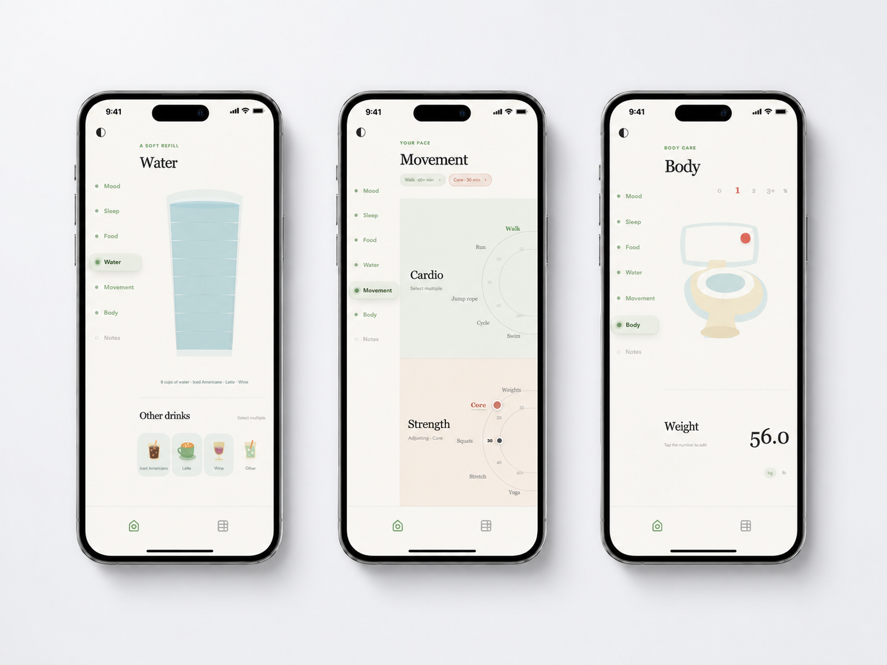

# Luna Body Tracker

Luna is a gentle self-care journal for noticing how life and the body feel without turning everyday care into a health dashboard.

## Product Preview





The current product iteration is intentionally focused on three surfaces:

- **Web App** — the primary mobile-first interaction prototype and future product UI.
- **Luna Skill** — controlled reading, validation, and summary of Luna records for AI agents.
- **Yun Tracker StickS3** — a small physical companion that turns daily records into calm world interactions.

## Active Apps

### Web App

`apps/web` contains the high-fidelity React prototype developed during the current design iteration. It explores Luna's Today journal, weekly reflection, editable daily detail, settings/export entry points, custom SVG illustrations, and mobile interaction language.

```sh
pnpm --filter @luna-body-tracker/web dev
pnpm --filter @luna-body-tracker/web build
```

The current prototype is local and frontend-only. It does not require login, a database, or a backend.

### Luna Skill

`apps/skill` provides the retained agent-facing skill surface, built on the shared schema and AI Skill SDK.

```sh
pnpm --filter @luna-body-tracker/skill typecheck
pnpm --filter @luna-body-tracker/skill self-check
```

### Yun Tracker StickS3

`apps/yun-tracker-stickS3` contains the active M5Stack StickS3 hardware experiment. Mood, food, water, sleep, movement, bowel movement, stress, and oracle actions become small scenes in Yun's world.

## Shared Packages

- `packages/ui` — shared hand-drawn illustrations and Storybook components
- `packages/schema` — record and module definitions
- `packages/import-export` — JSONL and Markdown exchange formats
- `packages/ai-skill-sdk` — reusable Skill behavior
- `packages/sync-protocol` — compatibility protocol retained for future evaluation; no active sync service is shipped

## Illustration Library

The Web App and Storybook share Luna's custom soft, outline-free SVG illustration system.

```sh
pnpm storybook
pnpm build-storybook
```

## Repository Structure

```text
luna-body-tracker/
  apps/
    web/
    skill/
    yun-tracker-stickS3/
  packages/
    ai-skill-sdk/
    import-export/
    schema/
    sync-protocol/
    ui/
  harness/
  docs/
```

## Current Product Boundaries

- No account system
- No required backend
- No active cross-device sync service
- No payment or marketplace
- No medical diagnosis or clinical health monitoring

The earlier sync server was not yet validated and has been removed from the active product scope. The versioned protocol remains temporarily so a future sync design can be evaluated without coupling the current Web App to an unproven backend.

## Design Principles

- Large breathing space and calm editorial hierarchy
- Low-pressure personal reflection rather than analytics
- User-owned, open export formats
- Local-first direction
- Shared visual language across Web and Yun hardware
- AI access through controlled tools rather than raw storage

## Verification

```sh
pnpm --filter @luna-body-tracker/web build
pnpm --filter @luna-body-tracker/ui typecheck
pnpm --filter @luna-body-tracker/skill typecheck
pnpm --filter @luna-body-tracker/skill self-check
pnpm test
pnpm build-storybook
```

The repository is licensed under Apache-2.0.
